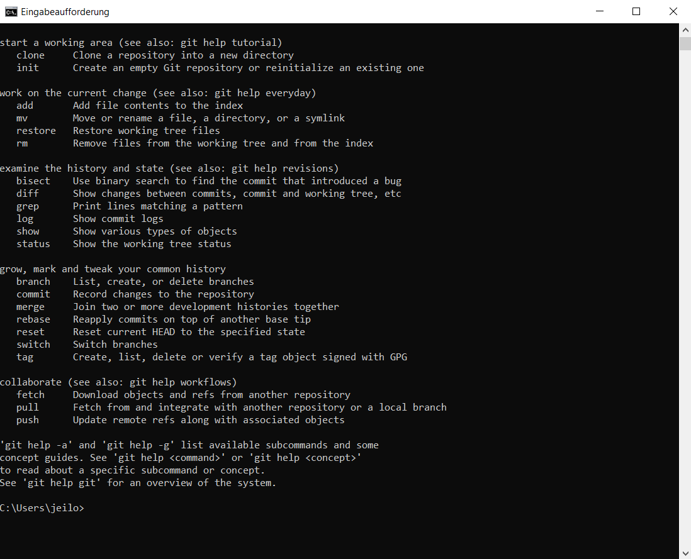

# Git instalations Guide

Bevor Sie auf "Weiter" klicken, folgen Sie den Schritten in den Bildern und vergewissern Sie sich, dass Sie die gleichen Optionen ausgewählt haben.

Sie können nun überprüfen, ob alles funktioniert hat, indem Sie "CMD" in die Windows-Suchleiste eingeben, die "Eingabeaufforderung" öffnen, "git" eingeben und die Eingabetaste drücken. 

Es sollte nun wie auf dem Bild aussehen.SS

